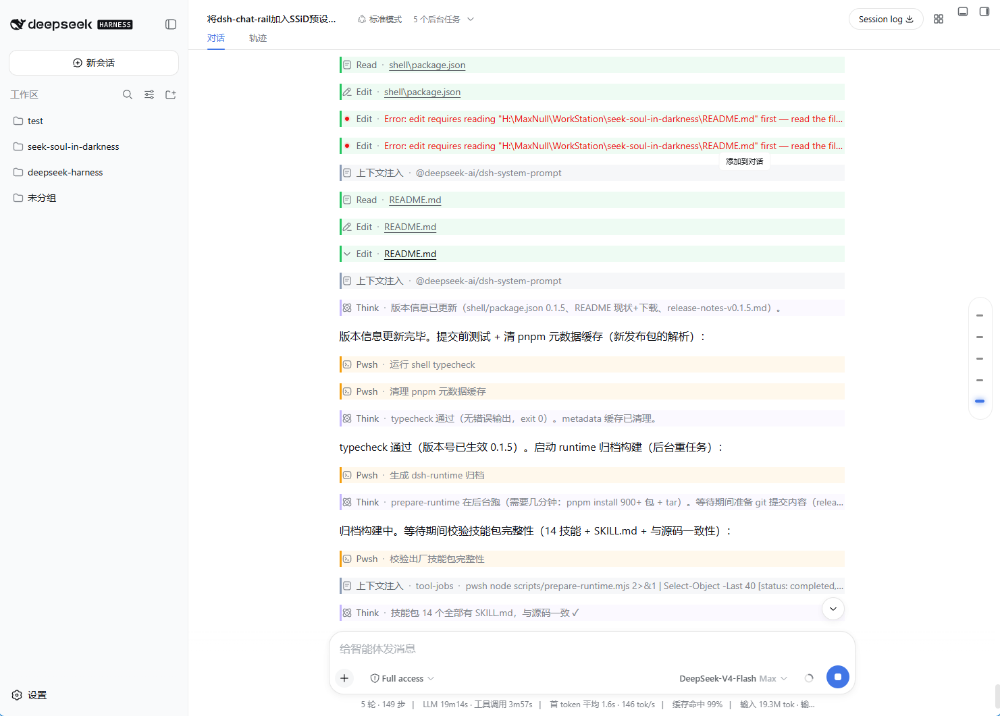
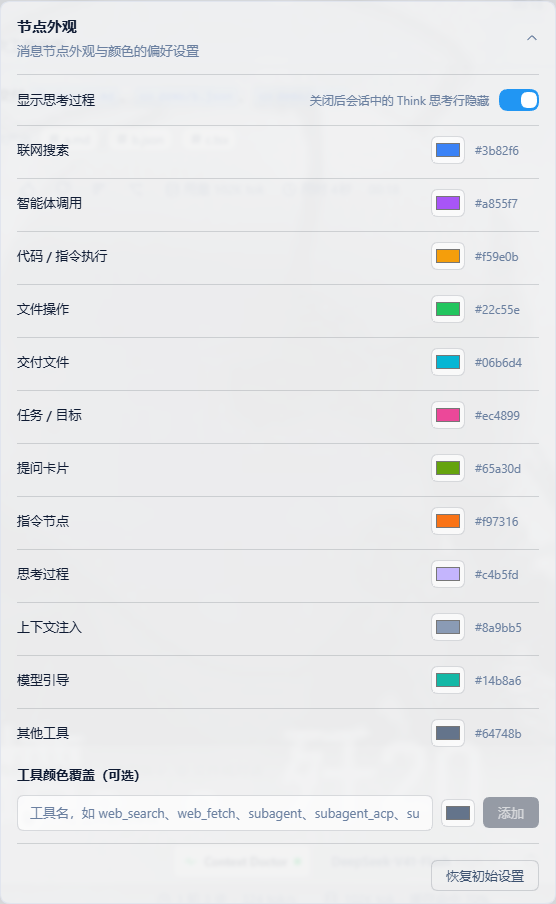
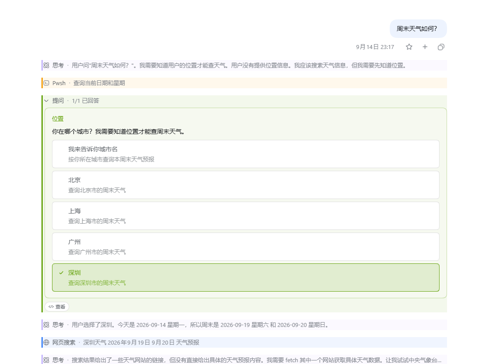
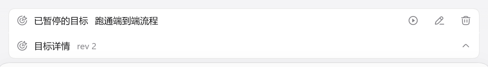
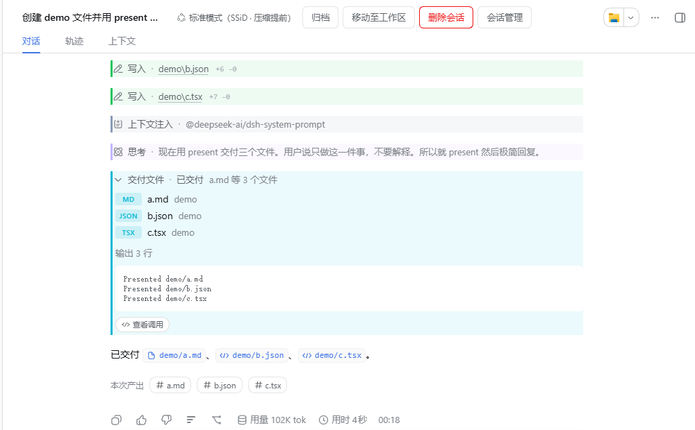

# dsh-node-appearance

本插件属于 **`@max-null/*` 插件系列**——这一系列共同构成 **[SSID（思灵 · Seek Soul in Darkness）](https://github.com/Max-Null/seek-soul-in-darkness)** 桌面体验。SSID 是整合它们的盒：`dsh-capture` · `dsh-chat-rail` · `dsh-chinese-thinking` · `dsh-draft-polish` · `dsh-guardian` · `dsh-habit` · `dsh-memory` · `dsh-node-appearance` · `dsh-plugin-center` · `dsh-quick-toolbar` · `dsh-skill-mcp-center` · `dsh-ssid-panels` · `dsh-ssid-zh-ui` · `dsh-achievements`。

This plugin belongs to the **`@max-null/*` family** — a set of plugins that together form the **[SSID (思灵 · Seek Soul in Darkness)](https://github.com/Max-Null/seek-soul-in-darkness)** desktop experience.

会话节点外观插件：按节点类型 / 工具名给 DeepSeek Harness Web GUI 的会话面板节点着色（可配置配色），并提供"显示思考过程"开关。纯前端渲染增强，不改 DSH 源码，`cordis.yml` 一行挂载。

## 功能

- **节点着色**：工具调用、联网搜索、智能体调用、代码 / 指令执行、文件操作、交付文件、任务 / 目标、指令节点（`/command`）、思考行（Think）——每种类别一个可配置颜色，左侧 3px 色条 + 淡色底，深 / 浅主题均可读。
- **工具级颜色覆盖**：任意工具名（如 `web_search`、`subagent`、`run_code`）可单独指定颜色，优先级高于类别色。
- **提问卡片**：`ask_user_question` 的卡片改为展示**当时给出的全部选项**，被选中的选项用 `ask` 类别色（默认蓝）反显并打勾。官方转录卡只保留已选答案，提问一旦结算就再也看不到其他选项 —— 本插件把选项读回来。
- **目标条详情**：官方目标条下方接一条**与它拼成同一张卡**的详情行（借待办卡片的折叠形态），把官方条上被 ellipsis 截断的目标展开成可读详情：完整目标、阶段、阻塞原因、自主轮次、目标标识。只读投影，不碰官方的编辑/暂停/清除，那四个按钮仍是官方在跑。
- **交付文件行**：`present` 的行改为折叠态只报「首个文件名 + 数量」，展开后逐文件成行（扩展名徽标 + 文件名 + 所在目录），并在结果文本上方标注行数。官方折叠行把全部文件名逗号拼成一行（`fileNames()` 的 `.join(', ')`），多文件时读不完，也看不出这一轮交付了几个。配色单列 `deliver` 类别（默认青蓝 `#06b6d4`）——本轮生成文件的那些行与交付行常常同屏出现，与 `file`（`read`/`write`）共用绿色会分不清谁是谁。
- **思考过程显示开关**：关闭后 Think 思考行前端隐藏（`display: none`），配置项与配色在同一张设置卡片里。
- **即时生效**：设置改动立即重绘会话，并持久化到 DSH 用户设置文档（`$DSH_HOME/settings.yaml`）。

## 截图

| 会话节点着色 | 设置卡片 |
|---|---|
|  |  |

| 提问卡片 | 目标条（折叠 / 展开） |
|---|---|
|  |   |

| 交付文件行（折叠） |
|---|
|  |

| 交付文件行（展开 · 青＝交付、绿＝写入） |
|---|
|  |

## 安装

```sh
# 在 dsh profile 目录（如 ~/.dsh/profiles/web）
pnpm add @max-null/dsh-node-appearance
```

在 profile 的 `package.json`（`dsh.profile.bundles`）加入 `@max-null/dsh-node-appearance`，或在 profile 的 `cordis.patch.yml` 插入：

```yaml
- insert:
    - id: node-appearance
      name: '@max-null/dsh-node-appearance'
```

重启 `dsh web` 后生效。设置入口：设置 → 插件配置 → **节点外观**。

## 配置

`cordis.yml` / settings 文档均可覆盖（以下为初始化配色）：

```yaml
node-appearance:
  showThinking: true
  colors:
    search: '#3b82f6'    # 联网搜索
    agent: '#a855f7'     # 智能体调用
    execute: '#f59e0b'   # 代码 / 指令执行
    file: '#22c55e'      # 文件操作
    deliver: '#06b6d4'   # 交付文件（present 行）
    task: '#ec4899'      # 任务 / 目标
    ask: '#65a30d'       # 提问卡片
    command: '#f97316'   # 指令节点
    thinking: '#c4b5fd'  # 思考过程
    context: '#8a9bb5'   # 上下文注入
    other: '#64748b'     # 其他工具
  toolColors: {}         # 工具名 → 颜色覆盖
```

## 工作方式

双面插件（Host + browser half，`dsh.client` bundle 由 DSH client 模块系统自动加载）：

- Host half 通过 `installSettingsSection` 注册 `node-appearance` settings namespace，插件配置作为 base 层。
- Browser half 绑定 `ctx.settingsScope`，把快照交给纯函数 `buildCss()` 生成 CSS，注入一个 `<style data-plugin-css="node-appearance/rules">` 标签；快照变化即重绘。
- 着色目标全部使用 DSH 会话 DOM 的稳定 data 属性（`data-chat-flow-kind` / `data-tool` / `data-variant`），不依赖任何 CSS Modules 哈希类名。
- 提问卡片是**接管**而非样式覆盖：`tool.call.toolview` 是 keyed slot，同一 key 只有最低 priority 的注册会渲染（DSH 的 slot 契约原话是 "a key the shipped composition already covers is replaced, not shared"），插件以 `priority: -1` 注册自己的 `ask_user_question` 视图，从调用参数里读回官方丢弃的 `options`。行外壳（24px 折叠行、running 扫光、Inspect 胶囊）与官方 `ToolRow` 逐项对齐，组件复用共享的 `ui-primitives`，locale 文案复用官方 `conversation` 字典。
- 交付文件行同样是**接管**：官方 ui-deliverables 在 `tool.call.toolview` 的 `present` key 上有一条 priority 0 的注册，插件以同样的 `priority: -1` 遮蔽它。字段取用面照官方 `PresentRow`（结算前读 `block.argsRaw`、结算后读 `block.call.argsRaw`，半截 JSON 原样显示参数文本而不是当成零个文件），行外壳与提问卡同一套基线，locale 文案复用官方 `deliverables` 字典（`row.title` / `row.ok` / `row.inspect` …）。派生逻辑在纯函数 `deliverable-model.ts` 里，组件只做 JSX。
- 目标详情折叠条是**并列追加**而非接管：`conversation.input.dock` 是 list 槽（官方占 `todo` order 0 / `goal` order 10 / `queue` order 20），插件以 `order: 11` 紧随官方目标条追加自己的条目，只读 `useProjection('goal')`。官方的 edit/pause/resume/clear 是 ui-goal 的注册者私有注入面（四个 Remote 动词 + 一个带竞态防护的 activation 订阅源），接管它们等于在本插件里再养一套会写会话数据的 RPC 客户端。

## 已知限制

- v0.1 不做运行态动画与节点折叠。
- 提问卡是接管式实现：组件来自共享 `ui-primitives`、业务字段只读调用与结果的 JSON，但官方 `ask_user_question` 的行外壳若变更，插件需同步。
- 提问卡高度随内容自适应、不做卡片内滚动；选项极多时由整条会话流承担滚动。
- 交付行同为接管式实现：官方 `present` 的字段取用面若变更，插件需同步。
- 交付行的折叠摘要（「… 等 N 个文件」）与展开区的「输出 N 行」是插件自有文案：官方 `deliverables` 字典没有对应 key，与目标详情条直写中文同一取径。
- 命令节点只有类别色（`command`），暂无命令名级配色。
- `toolColors` 按工具名精确匹配；DSH 工具名变更时旧条目静默失效（可在设置面板删除）。

## 开发

```sh
npm install
npm run typecheck   # tsc
npm test            # vitest（CSS 规则生成 + Config schema + 提问卡派生 + 交付行派生）
npm run build       # tsc 类型 + tsdown（lib/index.js + lib/client.js）
```

## 文档

- [决策记录](docs/决策/2026-08-17-节点外观插件-独立插件决策.md)
- [设计方案](docs/设计/DSH节点外观插件-设计方案.md)

## SSID 系列

